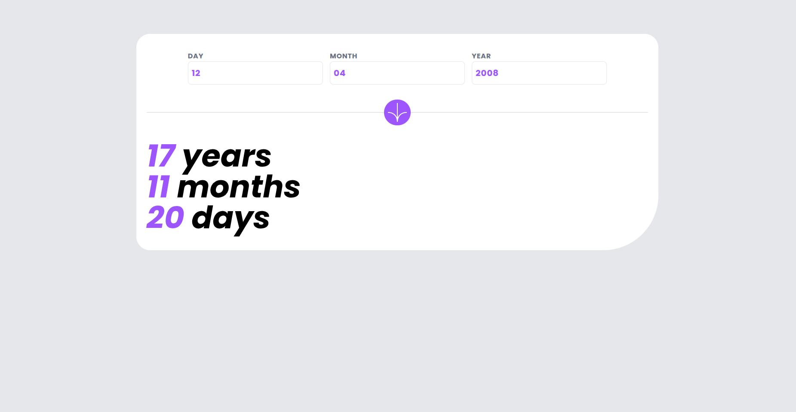
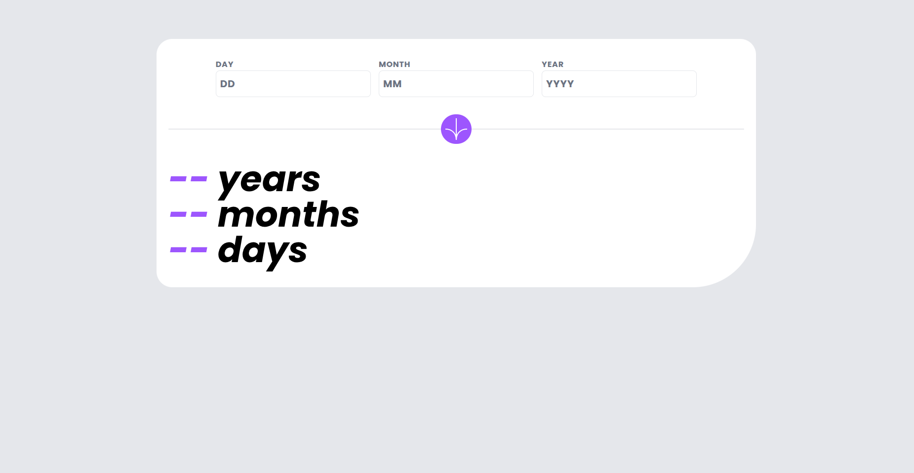
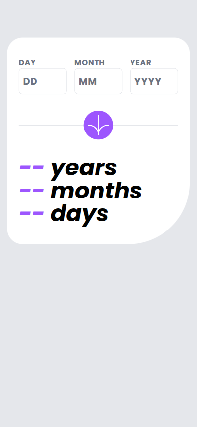

# Age Calculator App

A responsive and precise age calculator web application. This project calculates a user's exact age in years, months, and days, featuring real-time validation and a modern UI built with **Tailwind CSS**.



## 🚀 Live Demo

Try it out here: **https://zentshalal.github.io/age-calculator-app/**

## ✨ Features

- **Precise Calculation**: Accurately computes age in years, months, and days, handling complex calendar logic (leap years, varying month lengths).
- **Real-time Validation**: robust input checking for:
  - Empty fields.
  - Invalid dates (e.g., 32nd day, 13th month).
  - Future dates.
  - Dynamic error messages with visual feedback.
- **Modern UI/UX**: 
  - Built with **Tailwind CSS v4**.
  - Fully responsive design (Mobile-first approach).
  - Custom font integration (Poppins).
- **Vanilla JavaScript**: No frameworks used for logic, ensuring lightweight performance and deep understanding of DOM manipulation.

## 🛠️ Technologies Used

- **HTML5**: Semantic structure.
- **CSS**: Tailwind CSS v4 (via CDN for demonstration).
- **JavaScript (ES6+)**: 
  - DOM Manipulation.
  - Date Object logic.
  - Event Handling (`DOMContentLoaded`, `click`, `focusout`).

## 💻 Key Logic Challenges Solved

1. **Dynamic Day Validation**: The maximum allowed day changes dynamically based on the selected month (e.g., 28/29 for February, 30 for April).
2. **Date Arithmetic**: Correctly calculating the difference between two dates by "borrowing" days from the previous month when the current day is lower than the birth day.
3. **Leap Year Handling**: Automatically managed via the JavaScript `Date` object logic.

## 📦 Installation & Usage

You can run this project locally in seconds:

1. **Clone the repository**:
   ```bash
   git clone https://github.com/zentshalal/age-calculator-app.git
   cd age-calculator-app
   ```
2. **Open the file**: Simply open index.html in any modern web browser.
3. **No build step required**: The project uses vanilla JS and CDN for Tailwind, so no npm install or server setup is needed.

## 📸 Screenshots
- **Desktop view**<br/>
  
  
- **Mobile view**<br/>
  

## 🤝 Contributing
This project was developed as part of my self-taught journey to master full-stack web development fundamentals. Feel free to fork the repository or suggest improvements!

## 📬 Contact
**GitHub**: zentshalal
